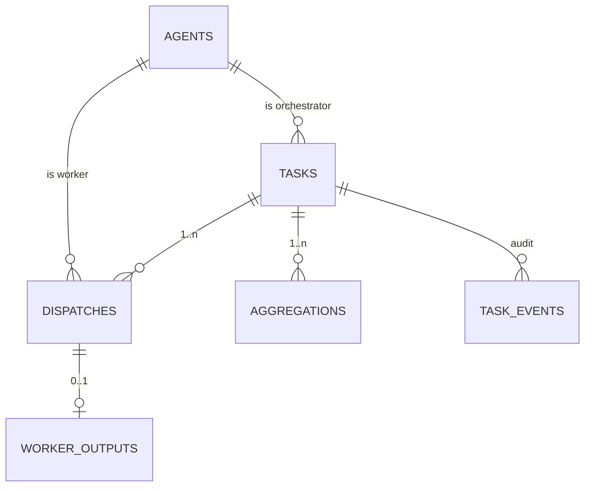
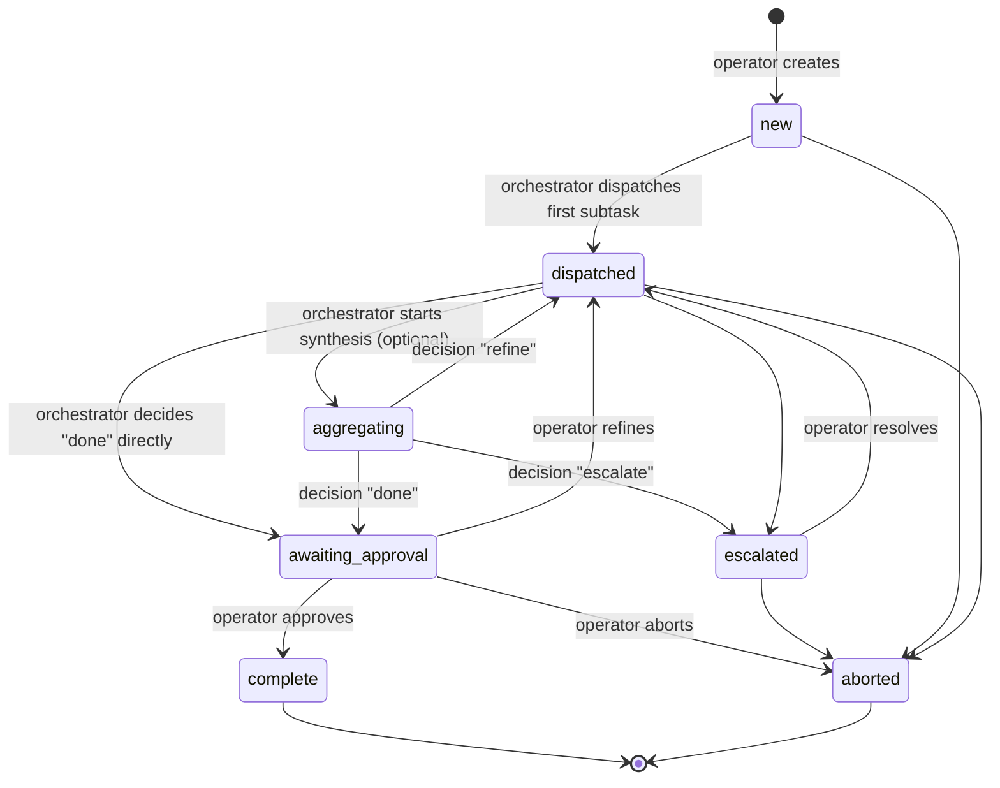

# Delphi Broker — v3 Architecture (Central Orchestration)

> **v2's hierarchical pipeline (R1 same-host pair → R2 arbitration → R3 review)
> required the operator to manually nudge each agent CLI per iteration.
> v3 collapses that into a single-orchestrator pattern: one always-on
> orchestrator agent decides everything between task creation and approval.**

---

## 1. Purpose

Eliminate the operator-as-cattle-prod problem v2's first session exposed
(workers sat idle 85 minutes between iterations because they had no signal
work had arrived). Re-centralize decision-making in one trusted agent;
keep the operator at the edges for task definition + approval only.

**What v3 keeps from v2:** FastAPI + SQLite + WAL, HMAC + replay protection,
per-agent env file pattern, MCP server scaffolding, the agent registry.

**What v3 deletes from v2:** rounds, iterations, reviews, the convergence
detector, the same-host pair semantics, R2 arbitration as a workflow stage,
the `awaiting_nudge` operator-cattle-prod step.

---

## 2. Roles

| Role | Who | Responsibilities |
|---|---|---|
| **Operator** | the human (Bryan) | Define task; approve / refine / abort the final artifact. **No per-iteration nudging.** |
| **Orchestrator** | one connected agent (default `pi-claude`) | Decompose task into subtasks; dispatch to workers; collect outputs; synthesize; decide done/refine/escalate |
| **Worker** | any non-orchestrator agent | Receive dispatches; produce outputs |

The orchestrator is **selected per task** via the web-UI dropdown. Any
registered agent can be an orchestrator.

### Independence rule (load-bearing)

> Once an agent is chosen as the orchestrator for a task, they are
> precluded from worker / implementation roles in that task.

`eligible_workers(task) = agents - {orchestrator_id}`. Enforced server-side
in `create_dispatch` — attempts to dispatch to oneself raise.

This replaces v2's "cross-host independent priors" property at a different
level: where v2 isolated worker pairs, v3 isolates the orchestrator from
the implementation. Bryan's framing: *"If we have a central orchestrator,
the orchestrator should not also be the worker — that's where bias does
the most damage."*

---

## 3. Data model



Five new tables, all prefixed `v3_` so v2 sessions remain readable:

| Table | Purpose |
|---|---|
| `v3_tasks` | Operator's unit of work. One orchestrator. JSON-augmentable. |
| `v3_dispatches` | Orchestrator → worker subtask assignment |
| `v3_worker_outputs` | Workers' responses (one per dispatch) |
| `v3_aggregations` | Orchestrator's syntheses + decisions |
| `v3_task_events` | Append-only audit log |

### Task statuses



Same-status transitions are idempotent no-ops (so retries are safe).

---

## 4. MCP tool surface

All HMAC-authenticated like v2's tools. Signature canonicals follow the
pipe-separator convention.

### Orchestrator-side

| Tool | Signature canonical | Effect |
|---|---|---|
| `delphi_v3_get_pending_task` | `v3_get_pending_task\|<agent_id>\|<client_ts>` | List non-terminal tasks I'm orchestrator for |
| `delphi_v3_dispatch` | `v3_dispatch\|<agent_id>\|<client_ts>\|<task_id>\|<worker_id>` | Send a subtask to a worker |
| `delphi_v3_collect_outputs` | `v3_collect_outputs\|<agent_id>\|<client_ts>\|<task_id>` | Read all worker outputs for a task |
| `delphi_v3_aggregate` | `v3_aggregate\|<agent_id>\|<client_ts>\|<task_id>\|<decision>` | Submit synthesis + decision |

### Worker-side

| Tool | Signature canonical | Effect |
|---|---|---|
| `delphi_v3_poll_dispatches` | `v3_poll_dispatches\|<agent_id>\|<client_ts>` | List dispatches assigned to me |
| `delphi_v3_emit_output` | `v3_emit_output\|<agent_id>\|<client_ts>\|<dispatch_id>` | Submit my response |

Server enforces:
- Only the task's orchestrator can dispatch / collect / aggregate for it
- Only the dispatch's worker can emit_output for it
- Independence rule: orchestrator can't dispatch to themselves
- Terminal-status guards: can't act on `complete` / `aborted` tasks

---

## 5. REST API + Web UI

### Operator REST (X-Operator-Token gated)

| Endpoint | Effect |
|---|---|
| `GET  /api/v2/agents` | List registered agents (orchestrator-dropdown source) |
| `POST /api/v2/tasks` | Create task |
| `GET  /api/v2/tasks` | List tasks |
| `GET  /api/v2/tasks/{id}` | Full state |
| `POST /api/v2/tasks/{id}/approve` | Operator approves with final artifact |
| `POST /api/v2/tasks/{id}/refine` | Operator sends back with comment |
| `POST /api/v2/tasks/{id}/abort` | Kill the task |
| `GET  /api/v2/tasks/{id}/events` | Audit log |

### Web UI

| Path | Purpose |
|---|---|
| `/web/v3/` | Task list (active first, terminal last) |
| `/web/v3/new` | Creation form with orchestrator dropdown + JSON pane |
| `/web/v3/{id}` | Live task view with approve / refine / abort buttons |

Cookie auth via the existing `/web/login` (operator token). Phone-friendly
— same shell as v2 web UI.

---

## 6. Wake-up problem & current mitigation

MCP is request/response. Agents call tools when their chat surface
prompts them to. There's no built-in "wake up" signal from broker to agent.

**Phase-1 spike validated** that the MCP SSE channel can deliver
`notifications/message` log events from the broker to a connected client
(empirically observed on the wire). Whether Claude Code surfaces those as
chat-visible events is **untested in v3** — to be validated in pilot.

**v3 ships with polling as the default mechanism.** Workers and
orchestrator-as-agent run a poll-respond loop:

```
loop:
    poll_dispatches() / get_pending_task()
    if work: act, emit, continue
    else: sleep ~30s, repeat
```

Once empirical pilot data tells us whether `notifications/message` surfaces
to Claude Code, we add broker-side push as an enhancement (filed as
[issue #7](https://github.com/strommy76/delphi-broker/issues/7)). With push
working, polling becomes a backstop; without it, polling is the primary
mechanism.

---

## 7. Open enhancements / future work

| Issue | What |
|---|---|
| [#5](https://github.com/strommy76/delphi-broker/issues/5) | One-time bootstrap-token registration MCP tool |
| [#6](https://github.com/strommy76/delphi-broker/issues/6) | Session-scoped group chat as side-channel |
| [#7](https://github.com/strommy76/delphi-broker/issues/7) | Broker pushes iteration-available notifications |

Daemonized agents (replace CLI sessions with API-backed brain) is the
long-term answer to fully eliminating the wake-up problem and
multi-task-per-worker scaling. Out of scope for v3.

---

## 8. Bootstrap exception

`pi-claude` built v3 itself despite the independence rule, because
pi-claude had the architectural context and the other agents didn't.
Once v3 is operational, the rule applies normally — delphi-broker tasks
go to `bsflow-claude` or another non-`pi-claude` orchestrator.
